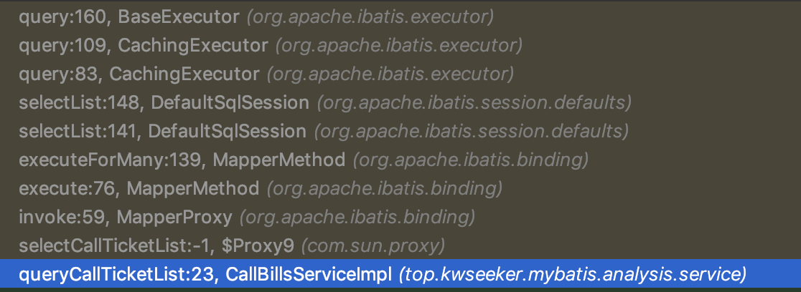

# MyBatis源码分析

## <font color="blue"> 准备工作 </font>

将 MyBatis 包的源码下载下来；不然 Idea 无法搜索源码。

查找 MyBatis 类被调用位置的快捷键：`Option + F7`

刚开始不要一行行地读代码，要根据类和方法名猜测其功能（主要关注非private方法，和初始化方法或代码块），
然后根据这些类和方法名猜测功能大概是怎么实现的。然后根据自己的猜测选择在代码中合理的位置加断点，调试。

为了使分析 Mybatis 代码更清晰，尽量不要引入其他没有必要的库。
一个`Java命令行`+`Mybatis`就好,所以下面这个接口需要从公司代码中提到这个Java命名行应用工程中。

## 如何定位源码

比如以下面这个工作中写的一个Mapper接口为例看看Mybatis源码是怎么读取并解析执行的。
```
@Select("<script>" +
        "select \n" +
        "    tnbi.tel_x,\n" +
        "    tcri.call_no,\n" +
        "    tcri.peer_no,\n" +
        "    tcri.finish_state,\n" +
        "    tcri.call_time,\n" +
        "    tcri.start_time,\n" +
        "    tcri.finish_time,\n" +
        "    tcri.call_duration\n" +
        "from tb_call_record_info tcri, tb_number_bind_info tnbi\n" +
        "where \n" +
        "<if test = \"callNo != null and callNo != '' \">\n" +
        "    call_no = #{callNo}\n" +
        "</if>\n" +
        "<if test = \"peerNo != null and peerNo != '' \">\n" +
        "    and peer_no = #{peerNo}\n" +
        "</if>\n" +
        "<if test = \"finishState != null and finishState != '' \">\n" +
        "    and finish_state = #{finishState}\n" +
        "</if>\n" +
        "<if test = \"callTime != null and callTime != '' \">\n" +
        "    and call_time = #{callTime}\n" +
        "</if>\n" +
        "and tcri.bind_id in (\n" +
        "    select bind_id from tb_number_info tni, tb_number_bind_info tnbi\n" +
        "    where tni.id = tnbi.number_info_id\n" +
        "       and tni.enterprise_id = #{enterpriseId}\n" +
        "    <if test = \"appId != null and appId != '' \">\n" +
        "       and tni.app_id = #{appId}\n" +
        "    </if>\n" +
        "    <if test = \"poolType != null and poolType != '' \">\n" +
        "       and tni.pool_type = #{poolType}\n" +
        "    </if>\n" +
        "    <if test = \"telX != null and telX != '' \">\n" +
        "       and tni.tel_x = #{telX}\n" +
        "    </if>\n" +
        ")\n" +
        "and tcri.bind_id = tnbi.bind_id\n" +
        "</script>")
List<QueryCallTicketListResp> selectCallTicketList(QueryCallTicketListReq req);
```

1. 我们按Mybatis规则定义了这个接口的功能，调用的时候，Mybatis肯定需要解析它；应该是通过
注释读取到的。然后看 @Select。

2. @Select 本身没有有效信息，然后看它在哪里被使用 `Option + F7`。跳转到 `MapperAnnotationBuilder`。
然后先看它的`初始化代码块`和`public方法`，然后可以在里面加断点。

    初始化方法
    ```
    public MapperAnnotationBuilder(Configuration configuration, Class<?> type) {
        String resource = type.getName().replace('.', '/') + ".java (best guess)";
        this.assistant = new MapperBuilderAssistant(configuration, resource);
        this.configuration = configuration;
        this.type = type;
    }
    ```

    很庆幸只有一个public方法(作为对外的窗口，它一定是最核心的方法)
    ```
    public void parse() {
        String resource = type.toString();
        if (!configuration.isResourceLoaded(resource)) {
          loadXmlResource();
          configuration.addLoadedResource(resource);
          assistant.setCurrentNamespace(type.getName());
          parseCache();
          parseCacheRef();
          Method[] methods = type.getMethods();
          for (Method method : methods) {
            try {
              // issue #237
              if (!method.isBridge()) {
                parseStatement(method);
              }
            } catch (IncompleteElementException e) {
              configuration.addIncompleteMethod(new MethodResolver(this, method));
            }
          }
        }
        parsePendingMethods();
    }
    ```
    
3. `MapperAnnotationBuilder`构造方法的调用堆栈 和 parse()被调用的地方。

    + `MapperAnnotationBuilder`构造方法的调用堆栈
        
        SqlSessionFactory初始化流程堆栈图（注意这里只是主要的流程）
        
        
        可以在这个堆栈流程中添加断点获取参数信息，以及猜测每个类的功能  
        
        `SqlSessionFactoryBuilder`  
        主要做了两件事：创建配置解析器；解析配置。
        ```
        XMLConfigBuilder parser = new XMLConfigBuilder(inputStream, environment, properties);
        return build(parser.parse());
        ```
        
        `XmlConfigBuilder`  
        解析配置
        ```
        //看代码 XNode root 来自 parser.evalNode("/configuration")
        //猜想是对应的mybatis-config.xml <configuration></configuration> 节点
        //这个执行完之后配置应该会被读取到 root
        private void parseConfiguration(XNode root) {
            try {
              //读取<properties></properties>中的属性
              // 1）<properties>节点可以有子节点，子节点会直接被当作属性值以键值对的方式读出
              // 2）<properties>可以通过source参数指定包含属性的本地文件
              // 3）<properties>也可以通过url指定包含属性的远程文件，但是url和source只能两选一，否则报BuilderException
              // 4）从configuration中读取属性variables，configuration的variables属性从哪里来的？（TODO）
              //    找到configuration的定义处在 BaseBuilder 的构造方法中，按 Option + F7 发现这个构造方法有7个地方引用
              //    根据代码推测是 XMLConfigBuilder 的构造方法传入的 
              //    private XMLConfigBuilder(XPathParser parser, String environment, Properties props){...}
              //    最终找到属性是从 SqlSessionFactoryBuilder 的 build() 方法传入的这个是用户可以直接调用的
              //    public SqlSessionFactory build(InputStream inputStream, String environment, Properties properties)
              // 5）前面读出的属性值会汇总到 defaults ，然后分别存入 parser 的 variables 变量 以及 configuration 的 variables
              propertiesElement(root.evalNode("properties"));
              Properties settings = settingsAsProperties(root.evalNode("settings"));
              loadCustomVfs(settings);
              typeAliasesElement(root.evalNode("typeAliases"));
              pluginElement(root.evalNode("plugins"));
              objectFactoryElement(root.evalNode("objectFactory"));
              objectWrapperFactoryElement(root.evalNode("objectWrapperFactory"));
              reflectorFactoryElement(root.evalNode("reflectorFactory"));
              settingsElement(settings);
              // read it after objectFactory and objectWrapperFactory issue #631
              environmentsElement(root.evalNode("environments"));
              databaseIdProviderElement(root.evalNode("databaseIdProvider"));
              typeHandlerElement(root.evalNode("typeHandlers"));
              mapperElement(root.evalNode("mappers"));
            } catch (Exception e) {
              throw new BuilderException("Error parsing SQL Mapper Configuration. Cause: " + e, e);
            }
        }
        ```
        
        `Configuration`  
        
        `MapperRegistry`  
        用于注册代码中的各个Mapper接口。  
        
        `MapperAnnotationBuilder`  
        猜测这个类是通过前面读取的配置以及接口定义及注解信息，组装Mapper接口的，这个类的每个实例针对一个Mapper接口
        如本例的 top.kwseeker.mybatis.analysis.dao.TbCallRecordDao 。  
        
        继续往后执行可以看到整个完整的初始化流程，最终返回`SqlSessionFactoryBuilder`成功构建一个
        SqlSessionFactory，后面就是Mapper接口调用流程转到第4小节。  
        
    + parse() 被 `MapperRegistry.addMapper()`调用
    
        parse() 在MapperRegistry.addMapper()的时候执行，工作流程：  
        1）加载Mapper接口的sql实现，从XML加载或者从 加载；
        2）解析上面加载的内容, 实现方法为`parseStatement()`，并加映射结果放入assistance（后面执行时应该是从这里面取）。
        ```
        parameterTypeClass  //参数类型，如案例的QueryCallTicketListReq
        languageDriver      //自定义的参数解析规则
        sqlSource           //用于生成sql Builder
        assistance          //
        ```
        3）
        
4. 使用通过解析注解或XML生成的`SqlSessionFactory`创建`SqlSession` 
    
    需要找到创建sql后调用获取结果的那个点加断点，然后就可以看到4，5，6的执行流程的堆栈信息。
    
    先放出来这个示例执行查询的堆栈图
    

    `MapperProxy`
    
    `MapperMethod`
    
    `DefaultSqlSession`
    
    `CachingExecutor`
    
    `BaseExecutor`
    ```
    @Override
    public <E> List<E> query(Statement statement, ResultHandler resultHandler) throws SQLException {
        PreparedStatement ps = (PreparedStatement) statement;
        ps.execute();
        return resultSetHandler.<E> handleResultSets(ps);
    }
    ```
    
5. 使用`SqlSession` getMapper创建sql

6. 执行生成的sql完成查询。


总结：

两个重要的断点位置：  
1）初始化阶段：`MapperBuilderAssitant.addMappedStatement()`, 在这个位置加断点可以看到最完整的初始化阶段的堆栈信息。  
2）执行阶段：`PreparedStatementHandler.query()`, 在这个问题之加断点可以看到最完整的执行阶段的堆栈信息。  
上面说的只是适用这个示例。不同的配置和sql类型可能对应不同的位置（反正都是数据刚生成且待返回之前）。

最重要的方法：

+ 配置读取

    `XMLConfigBuilder.parseConfiguration()`

+ Mapper接口组装

